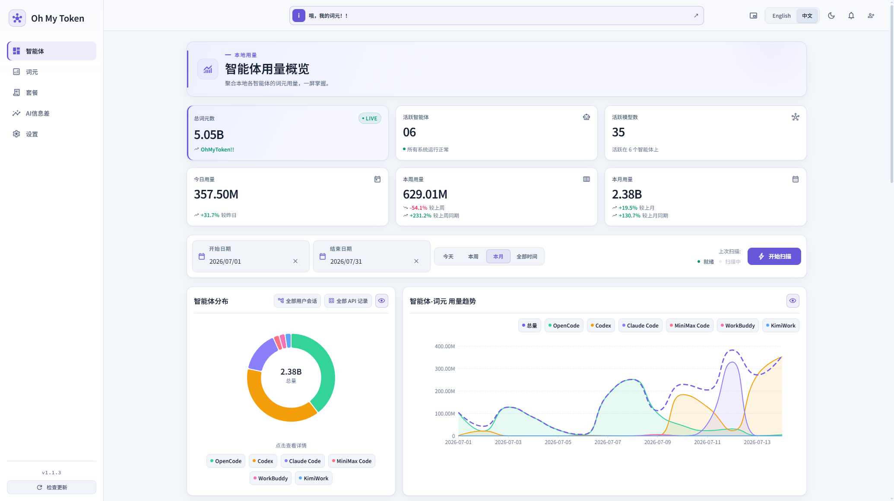
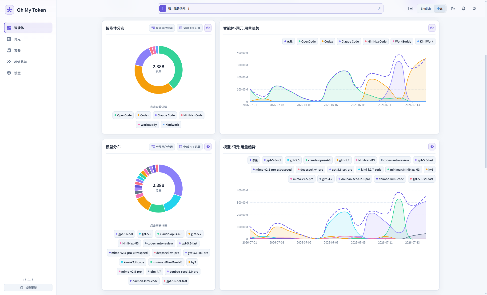
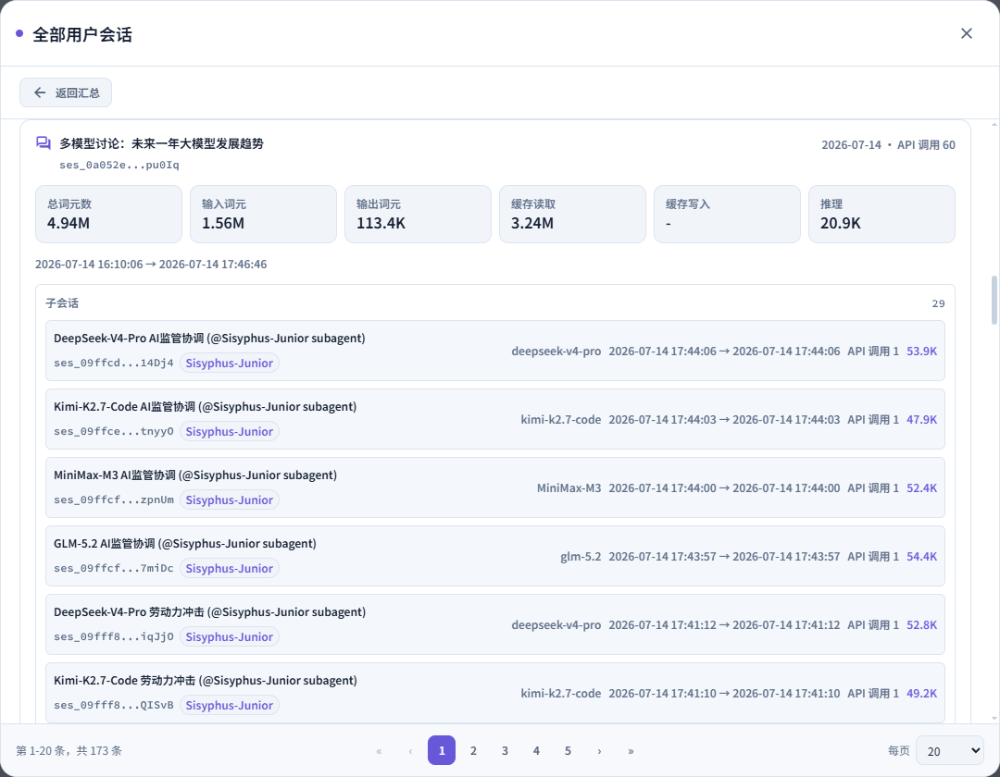
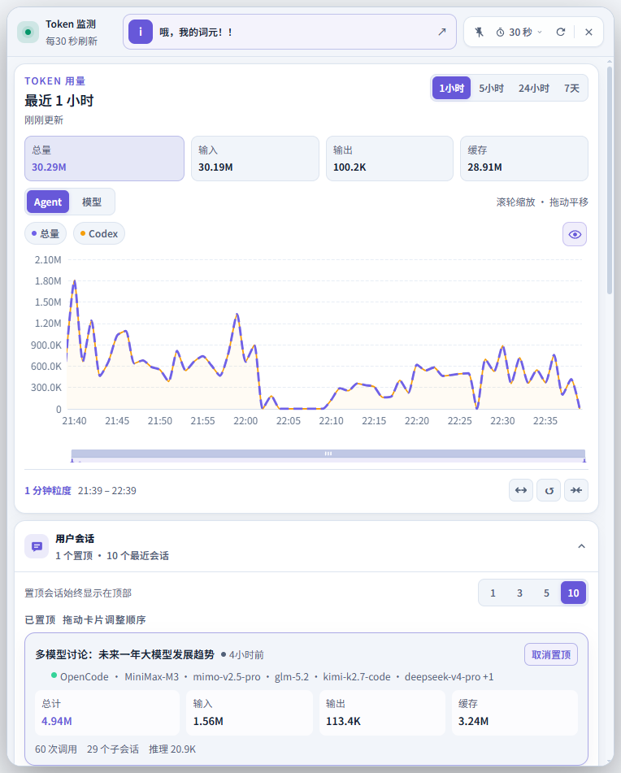
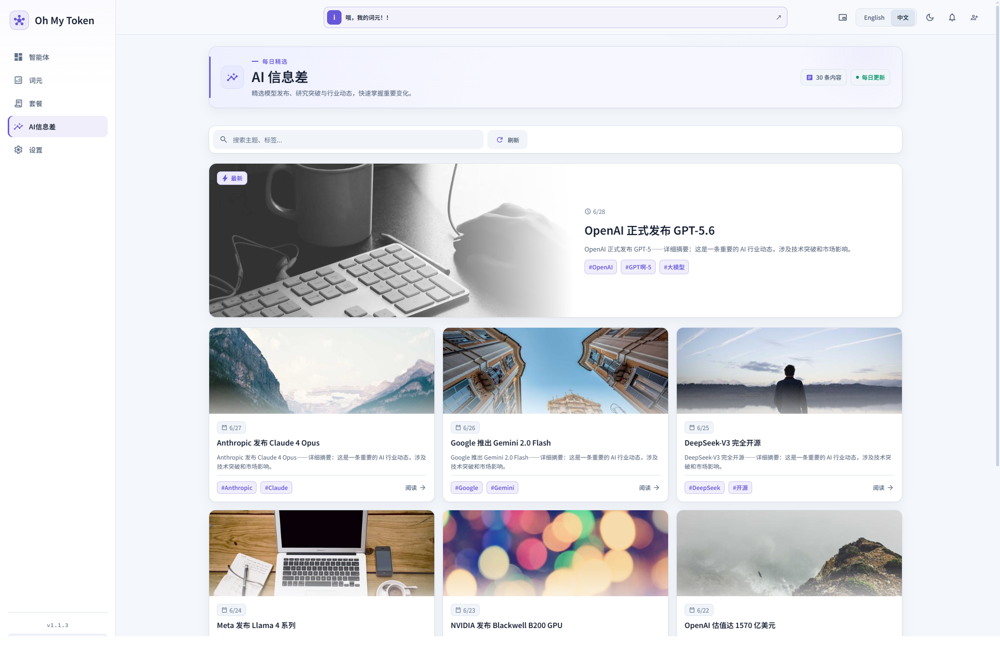

  

<h1 align="center">Oh My Token</h1>

  看清你每个模型的Token用量

  <strong>简体中文</strong> · <a href="README_EN.md">English</a>

---

## 开始使用

1. 前往 [Oh My Token 官网](https://ohmytoken.net) 获取应用。
2. 安装并打开 Oh My Token。
3. 启动扫描，应用会自动查找受支持的 Agent 用量数据。
4. 在仪表盘中查看总览、趋势、模型和会话明细。

## 系统支持

- Windows
- macOS

  

## 了解你的 Agent 的 Token 用量

Oh My Token 可以统计多种Agent的token用量。

## 它可以帮你做什么

- **统一查看**：在一个界面中汇总多个 Agent 的 Token 用量。
- **观察趋势**：按日、按月、按 Agent 和按模型查看变化与对比。
- **追踪明细**：深入查看模型和会话维度的数据，定位主要消耗来源。
- **随时关注**：使用悬浮窗口，在工作时快速查看当前 Token 情况。
- **发现更多**：了解最新的AI相关信息，一站式比价Token套餐
- **舒适使用**：支持简体中文与英文、浅色与深色主题。

## 界面预览

### Agent 与模型的Token用量

  

### 用户会话的Token用量

  

### Token 悬浮窗

  

### AI 信息差 实时了解最新AI信息

  

## 支持的 Agent

  <kbd>Claude Code</kbd>&nbsp;&nbsp;
  <kbd>Codex</kbd>&nbsp;&nbsp;
  <kbd>OpenCode</kbd>&nbsp;&nbsp;
  <kbd>Z Code</kbd>
    
  <kbd>MiniMax Code</kbd>&nbsp;&nbsp;
  <kbd>KimiWork</kbd>&nbsp;&nbsp;
  <kbd>Kimi Code</kbd>&nbsp;&nbsp;
  <kbd>WorkBuddy</kbd>
    
  <kbd>Gemini CLI</kbd>&nbsp;&nbsp;
  <kbd>Qwen Code</kbd>&nbsp;&nbsp;
  <kbd>OpenClaw</kbd>&nbsp;&nbsp;
  <kbd>Grok</kbd>
    
  <kbd>Zed Agent</kbd>&nbsp;&nbsp;
  <kbd>Goose</kbd>&nbsp;&nbsp;
  <kbd>Hermes</kbd>

