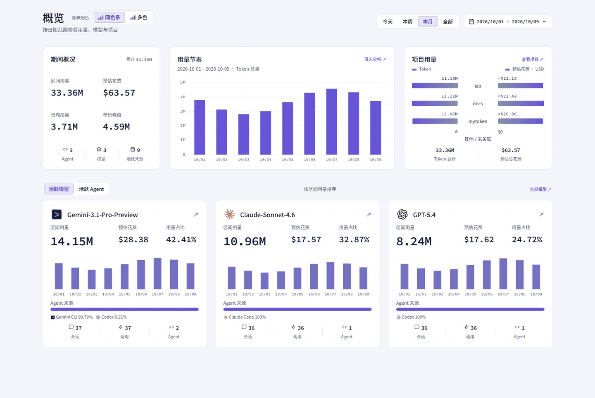
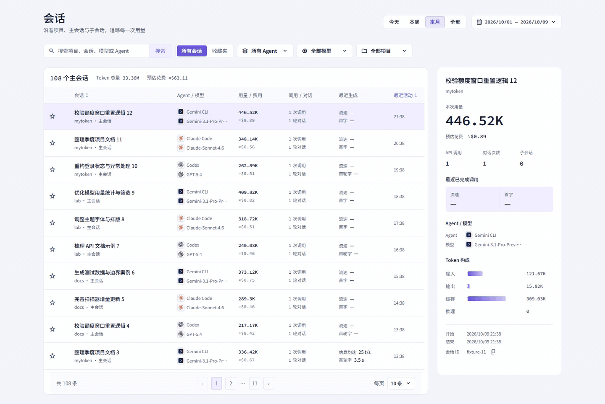
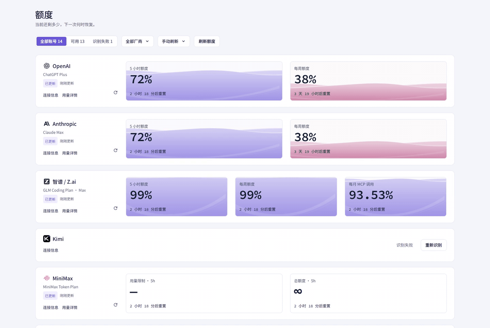
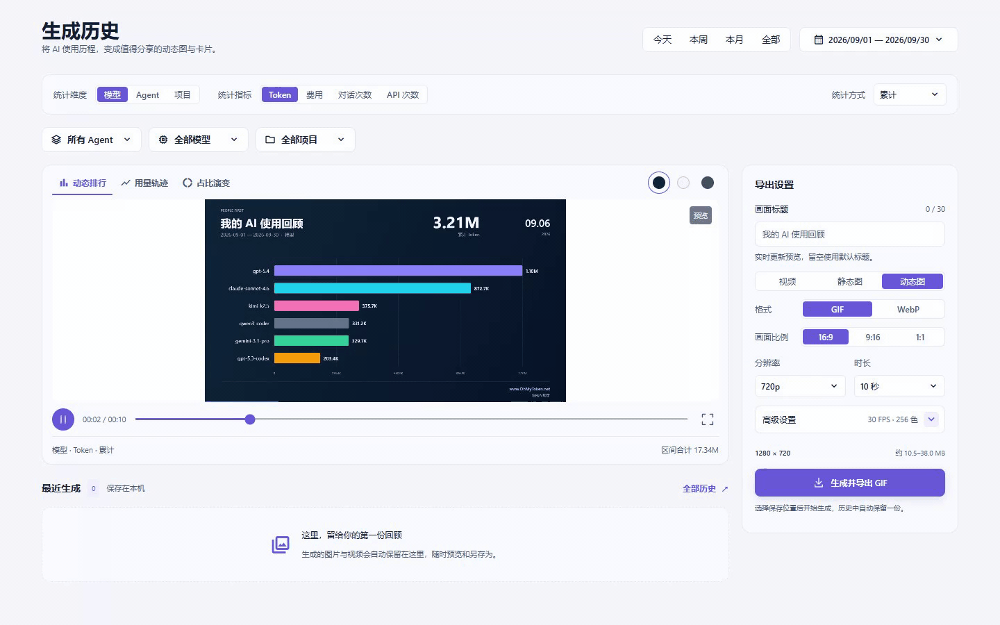
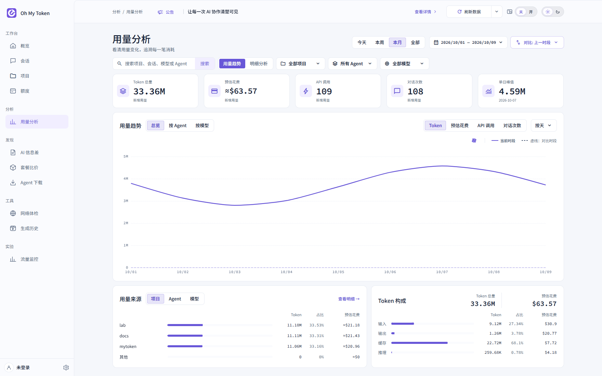
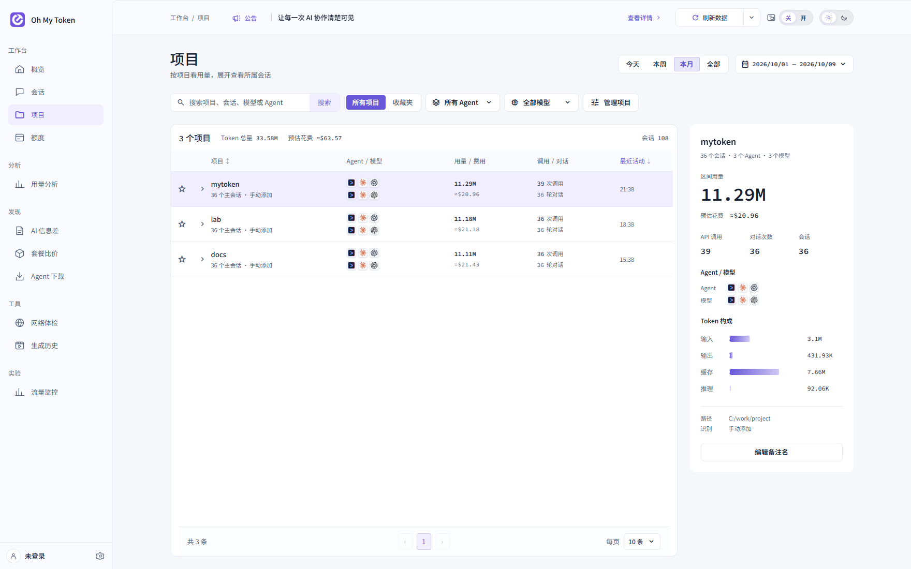
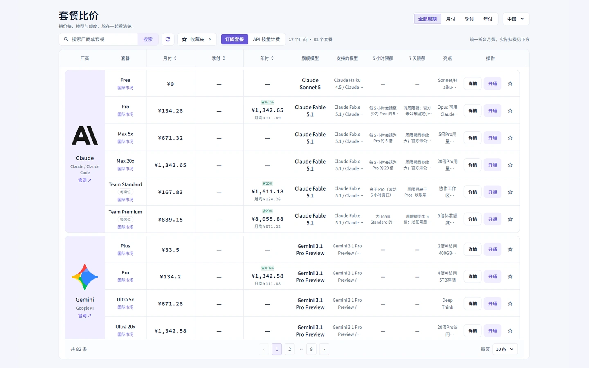
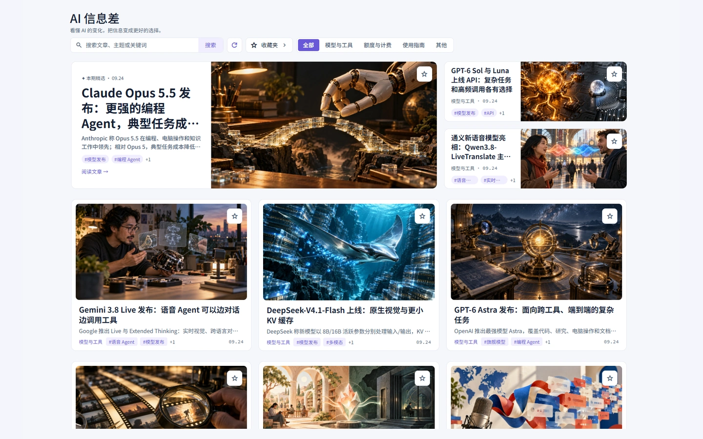
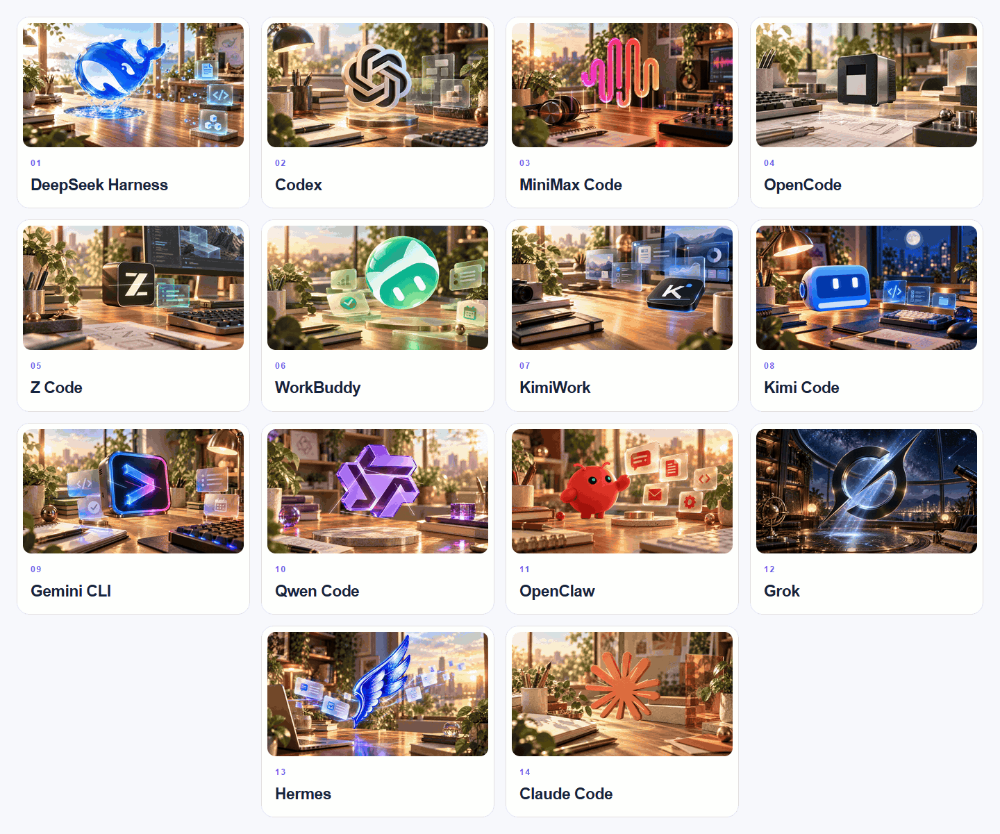

  

<h1 align="center">Oh My Token</h1>

  AI Agent 的 Token 用量，一个窗口看清。

  <strong>简体中文</strong> · <a href="README_EN.md">English</a>

  <a href="https://ohmytoken.net">下载 Windows / macOS 版</a> ·
  <a href="#支持的-agent">支持的 Agent</a> ·
  <a href="#界面预览">界面预览</a>

Oh My Token 汇总本机 [多种受支持的 Agent](#支持的-agent) 的用量，把消耗按 Agent、模型、会话和项目整理清楚。你可以查看用量趋势、API 参考费用与套餐余量，再把用量变化生成可分享的回顾。

## 界面预览

以下画面使用演示数据，金额、额度、价格和文章内容仅用于展示界面。点击动图可查看高清静态图。

### 看清用量，找到消耗来源

选定日期范围，集中查看 Token 用量、参考费用和趋势，再按 Agent、模型或项目找到主要消耗来源。费用按 API 价格规则估算，供参考，不等于厂商实际账单或套餐扣费。

### 把消耗落到会话和项目

搜索和筛选会话，展开子会话，查看模型调用与 Token 明细。项目工作区按记录中的目录归属汇总用量，也可以手动整理项目、收藏常用的会话和项目。

### 查看额度，留意重置时间

自动发现本机已有的受支持厂商连接，查询套餐余量与重置窗口。工作时，也可以通过桌面浮窗查看 Token、会话和额度，按需置顶或调整会话排序。

可查询的额度字段取决于厂商、账户授权和连接情况；支持某个 Agent 的本地扫描，不代表支持查询其厂商额度。

### 把用量变成可分享的回顾

将本地用量生成动态排行、趋势与占比变化，也可以制作静态总结卡片，导出 GIF、WebP、MP4、PNG 或 JPG。回顾以统计动画呈现用量变化。

云端发现内容还提供套餐与 API 比价、Agent 目录和 AI 信息差，需联网加载。

更多界面：用量分析、项目、套餐比价与 AI 信息差

#### 用量分析

#### 项目工作区

#### 套餐与 API 比价

#### AI 信息差

## 支持的 Agent

目前支持多种 Agent，不断更新。

可查看的明细以各 Agent 的本地记录为准。Token 分类与生成指标因数据源而异，部分数据源提供的是估算均速。

## 开始使用

1. 从 [Oh My Token 官网](https://ohmytoken.net) 下载对应平台的安装包，支持 Windows x64 与 macOS（Intel / Apple Silicon）。
2. 安装并打开应用，启动扫描，读取本机受支持 Agent 的用量记录。
3. 在概览、会话、项目和用量分析中查看消耗。已在 Agent 中登录或配置受支持厂商后，可进入额度页刷新查询。
4. 工作时打开桌面浮窗随时看一眼，或在“生成历史”中制作可分享的用量回顾。

界面支持简体中文与英文、浅色与深色主题，并提供多套配色、窗口材质与减少动态效果选项。

## 本地数据与联网功能

用量统计在本机完成，本地扫描不依赖云端在线，你的模型请求不经过 Oh My Token。

登录、发现内容、应用更新与厂商额度查询需要联网。客户端会发送必要的设备与版本信息；出现异常时可发送经脱敏的最小诊断事件，详细诊断日志由你确认后上传。

应用还提供网络体检与进程流量监控，帮助查看连接情况及发送、接收流量，具体能力取决于平台支持与系统权限。

## 许可与商业授权

本版本采用 [Oh My Token 源码可用许可证 1.0](LICENSE)。个人和企业内部使用、修改及免费分享不收取软件许可费。
**转售软件、销售修改版、以购买付费产品或服务为条件提供软件，以及收费向第三方提供软件全部或主要功能的在线服务，必须先取得许可方的书面授权。**
**修改版对外分发或提供在线服务时，必须免费公开对应完整源码，并将有权许可的衍生修改按同一许可提供；内部自用无需公开。**
取得销售或收费托管授权仍须履行源码义务。真实技术服务的允许范围见许可证第 4 条。

这不是 MIT 或 OSI 认可的开源许可证。已经按 MIT 授出的权利及第三方组件的独立许可证继续有效，详见 [许可范围](LICENSE_SCOPE.md) 和 [历史 MIT 声明](LICENSE-MIT-LEGACY)。
具体使用场景及授权方式见 [商业授权说明](COMMERCIAL_LICENSE.md)。商业授权须由许可方另行书面确认，付款或捐赠不自动构成授权；官方入口为 [Oh My Token 官网](https://ohmytoken.net)。

第三方组件的版本、来源和许可证原文见 [第三方开源软件声明](desktop/third-party-licenses/THIRD_PARTY_NOTICES.md)，也可在应用“设置 → 关于与更新 → 开源软件声明”中离线查看。
