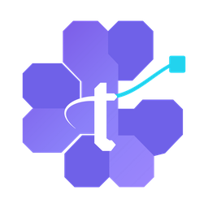
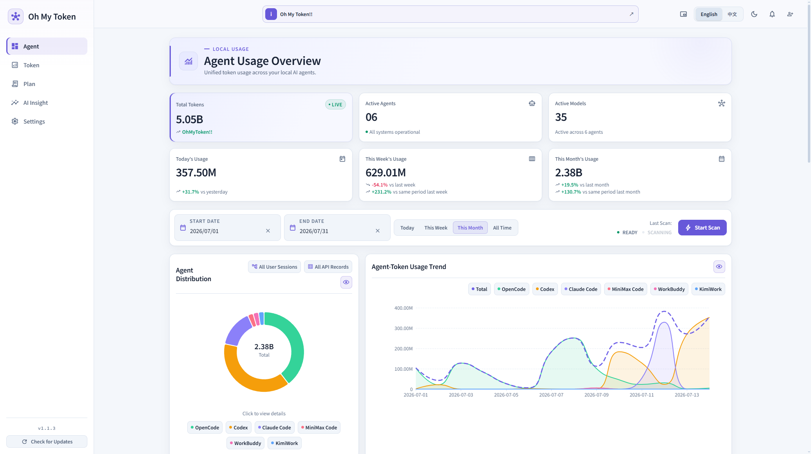
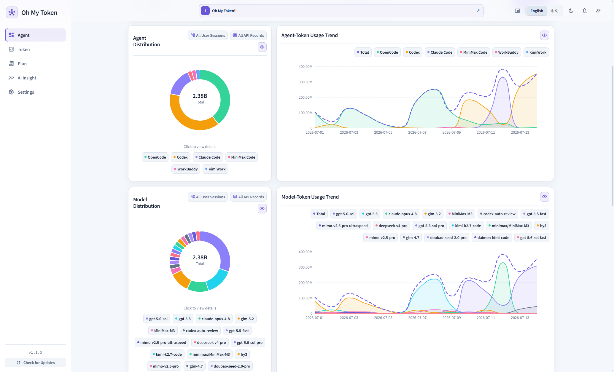
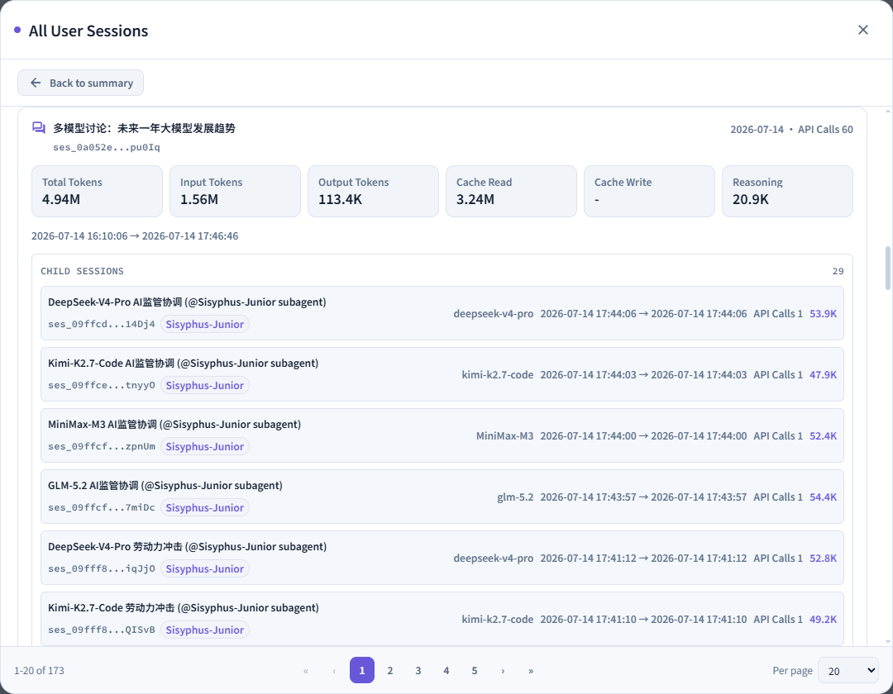
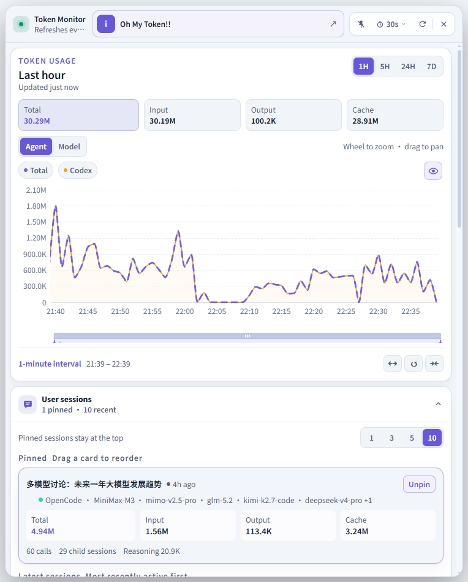
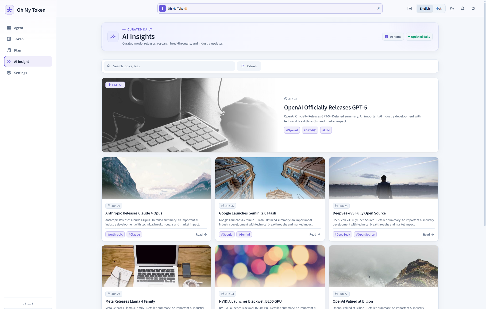

  

<h1 align="center">Oh My Token</h1>

  See token usage for every model at a glance.

  <a href="README.md">简体中文</a> · <strong>English</strong>

---

## Get started

1. Visit the [Oh My Token website](https://ohmytoken.net) to get the app.
2. Install and open Oh My Token.
3. Start a scan to collect usage data from supported agents.
4. Explore the overview, trends, models, and session details in the dashboard.

## System support

- Windows
- macOS

  

## Understand token usage across your agents

Oh My Token tracks token usage across multiple AI agents.

## What it helps you do

- **See everything together**: Review token usage from multiple agents in one place.
- **Follow trends**: Compare usage by day, month, agent, and model.
- **Explore details**: Drill down into model and session data to find where tokens are being used.
- **Keep an eye on usage**: Use the floating window for a quick view while you work.
- **Discover more**: Follow the latest AI developments and compare token plans in one place.
- **Make it yours**: Switch between Simplified Chinese and English, as well as light and dark themes.

## Product preview

### Token usage by agent and model

  

### Token usage by user session

  

### Token floating window

  

### AI insights: stay current with the latest AI developments

  

## Supported agents

  <kbd>Claude Code</kbd>&nbsp;&nbsp;
  <kbd>Codex</kbd>&nbsp;&nbsp;
  <kbd>OpenCode</kbd>&nbsp;&nbsp;
  <kbd>Z Code</kbd>
    
  <kbd>MiniMax Code</kbd>&nbsp;&nbsp;
  <kbd>KimiWork</kbd>&nbsp;&nbsp;
  <kbd>WorkBuddy</kbd>

