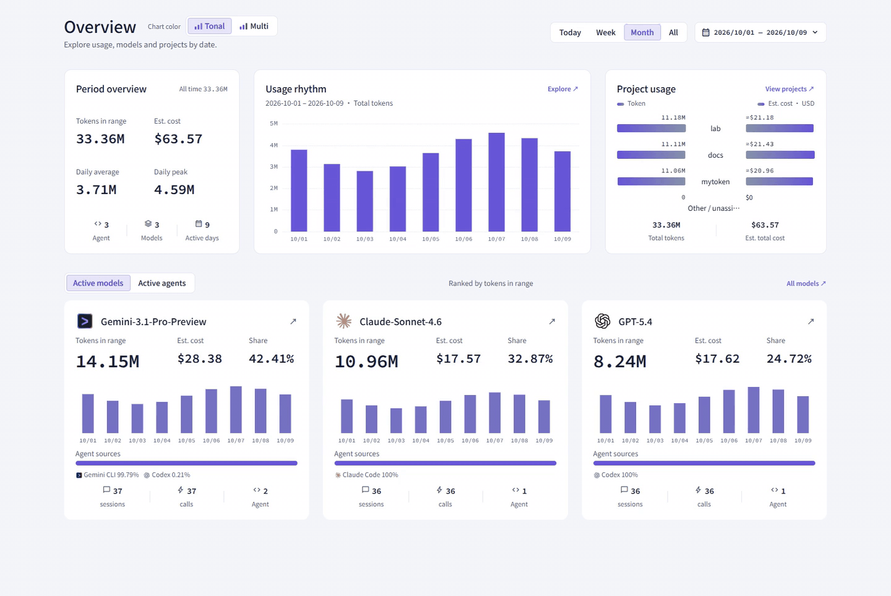
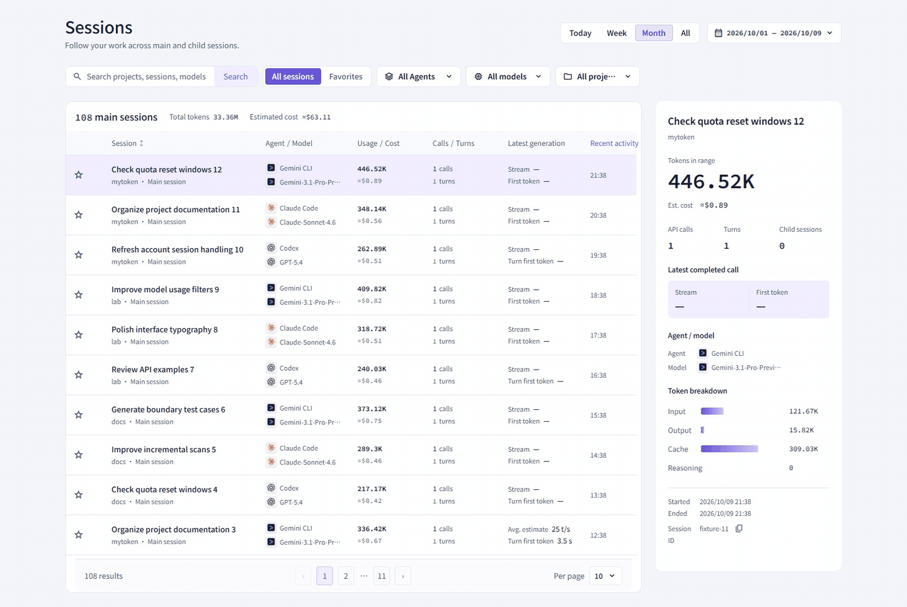
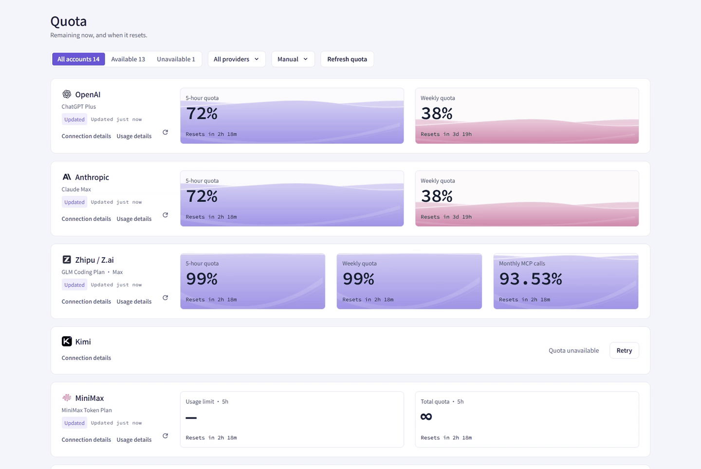
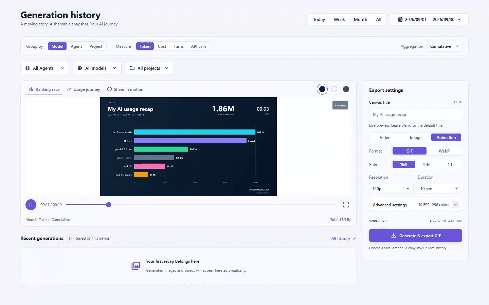
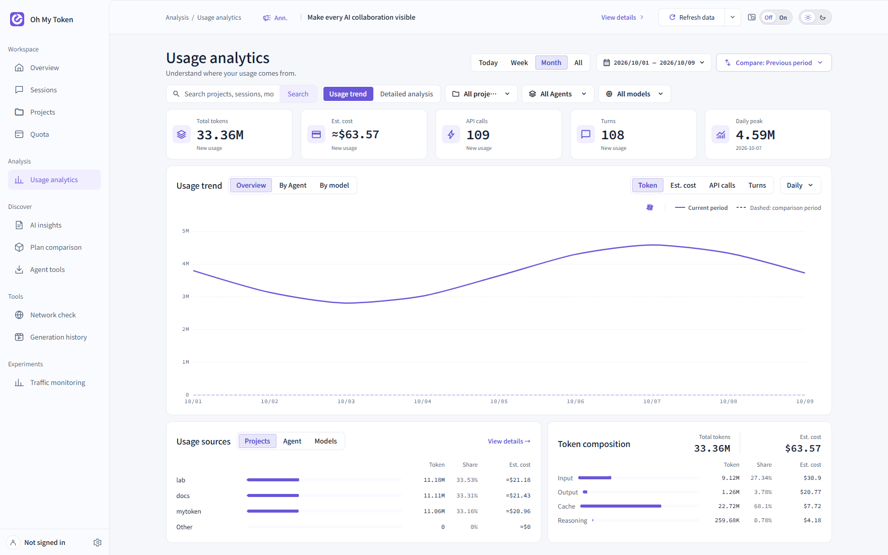
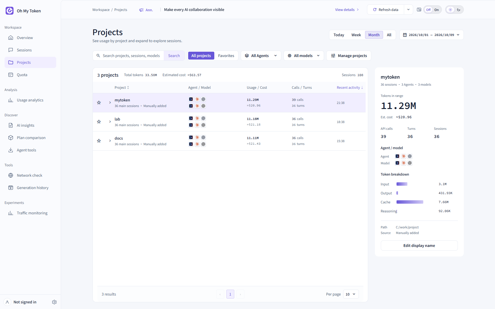
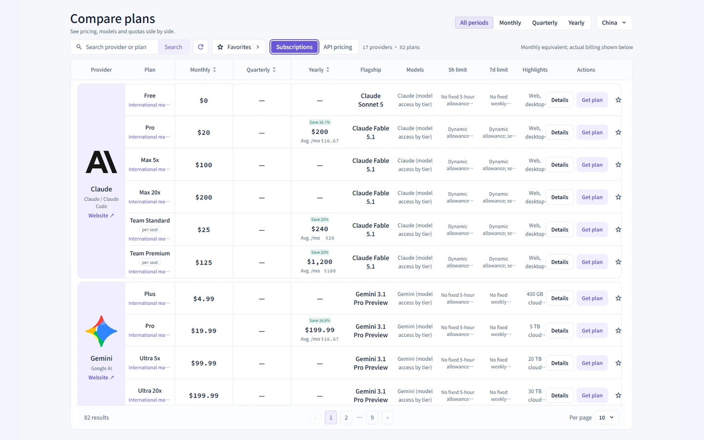
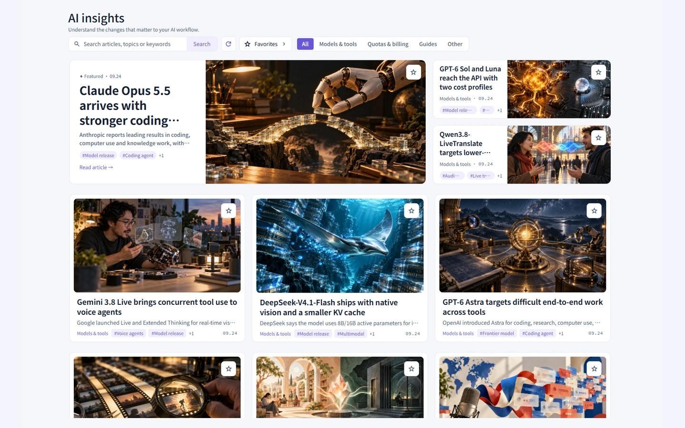

  

<h1 align="center">Oh My Token</h1>

  See where your AI tokens go — across agents, models, sessions, and projects.

  <a href="README.md">简体中文</a> · <strong>English</strong>

  <a href="https://ohmytoken.net">Download for Windows / macOS</a> ·
  <a href="#supported-agents">Supported agents</a> ·
  <a href="#product-preview">Product preview</a>

Oh My Token is a desktop app for understanding usage across multiple AI agents. It reads local usage records from [multiple supported agents](#supported-agents) and brings tokens, reference API costs, sessions, and projects into one workspace. Check provider quotas while you work, then turn your usage into a visual recap to share.

## Product preview

The previews use demo data. Amounts, quotas, prices, and articles illustrate the interface. Click an animation to open its full-resolution still image.

### See usage and reference costs together

Compare tokens and estimated API costs over a date range. Explore trends by agent, model, or project to see where usage is concentrated. Cost estimates are reference figures, not provider invoices or subscription deductions.

### Follow usage into sessions and projects

Search and filter sessions, expand sub-sessions, and inspect model calls and token details. The project workspace groups usage by its recorded directory. Organize projects and favorite sessions or projects you want to follow.

### Check quotas before continuing

Discover supported provider connections on your computer and check remaining quotas and reset windows. The floating window keeps tokens, sessions, and quotas within reach while you work, with an always-on-top toggle and session sorting.

Quota fields depend on the provider, account authorization, and connection. Support for scanning an agent's local usage does not imply support for querying its provider quota.

### Create a usage recap to share

Turn local usage into animated rankings, trends, and changing shares, or a still summary card. Export GIF, WebP, MP4, PNG, or JPG. These are visual summaries built from time-based usage totals.

Cloud discovery content also offers plan and API price comparison, an agent directory, and AI insights. Loading this content requires a network connection.

More screens: analytics, projects, plan comparison, and AI insights

#### Usage analytics

#### Project workspace

#### Plan and API price comparison

#### AI insights

## Supported agents

Supports multiple agents, with ongoing updates.

Available details depend on what each agent records locally. Token breakdowns and generation metrics vary by source; some sources provide estimated generation rates.

## Get started

1. Download the app from the [Oh My Token website](https://ohmytoken.net). Builds target Windows x64 and macOS on Intel or Apple Silicon.
2. Install and open the app, then start a scan to read usage records from supported agents on your computer.
3. Explore the overview, sessions, projects, and analytics. If you have already signed in to or configured a supported provider in an agent, open Quota and refresh to check its allowances.
4. Open the floating window for a quick view while you work, or create a recap in Generation history.

The interface supports Simplified Chinese and English, light and dark appearances, multiple color palettes, window materials, and reduced motion.

## Local data and online features

Usage statistics are processed on your computer, and local scanning works without the cloud being online. Your model requests do not pass through Oh My Token.

Sign-in, discovery content, updates, and provider quota queries use the network. The client sends necessary device and version information; runtime errors may send minimal, sanitized diagnostic events. Uploading detailed diagnostic logs requires your confirmation.

The app also offers network checks and process traffic monitoring to help inspect connectivity and sent and received traffic, subject to platform support and system permissions.

## License and commercial authorization

This version uses the [Oh My Token Source-Available License 1.0](LICENSE).
Personal and internal business use, modification, and free redistribution are permitted without software license fees, subject to its terms.
**Selling the software or derivative versions, making access to the software conditional on purchasing a paid product or service, or charging third parties for hosted access to all or substantially all of its functionality, requires the licensor's prior written authorization.**
**Modified versions distributed outside the organization or offered as online services to third parties must have their complete corresponding source made publicly available at no charge, with covered derivative modifications under the same license. Internal-only modifications need not be published.**
Sales or hosting authorization does not waive those source obligations. Section 4 describes permitted genuine technical services.

This is not MIT or an OSI-approved open-source license. Previously granted MIT rights and the independent licenses of third-party components remain effective; see [licensing scope](LICENSE_SCOPE.md) and the [historical MIT notice](LICENSE-MIT-LEGACY).
See the [commercial authorization guide](COMMERCIAL_LICENSE.md) for examples and authorization details. Commercial authorization must be confirmed separately in writing by the licensor; payment or donation alone is not authorization. The official project website is [ohmytoken.net](https://ohmytoken.net).

Third-party versions, sources, and original licenses are listed in [third-party software notices](desktop/third-party-licenses/THIRD_PARTY_NOTICES.md), also available offline in Settings → About and updates → Open-source software notices.
